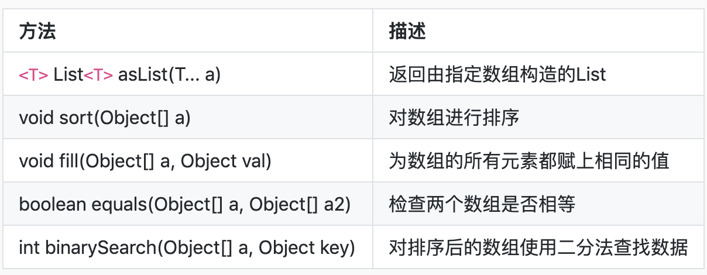
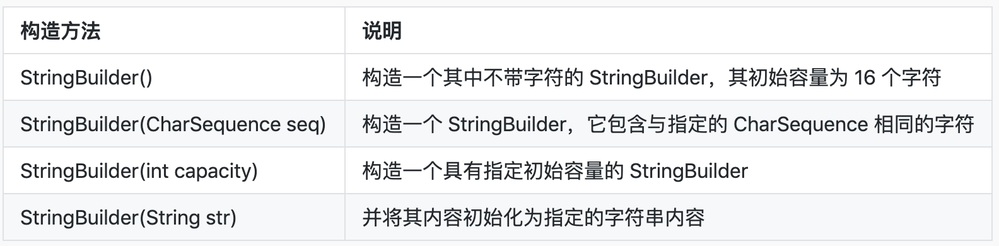
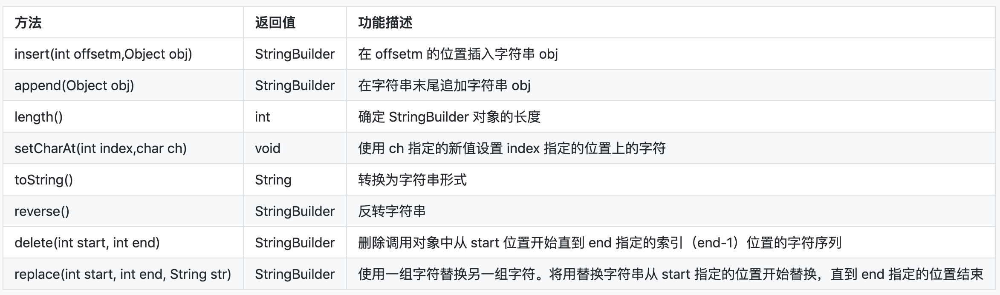
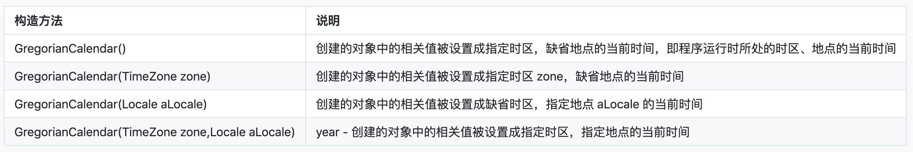
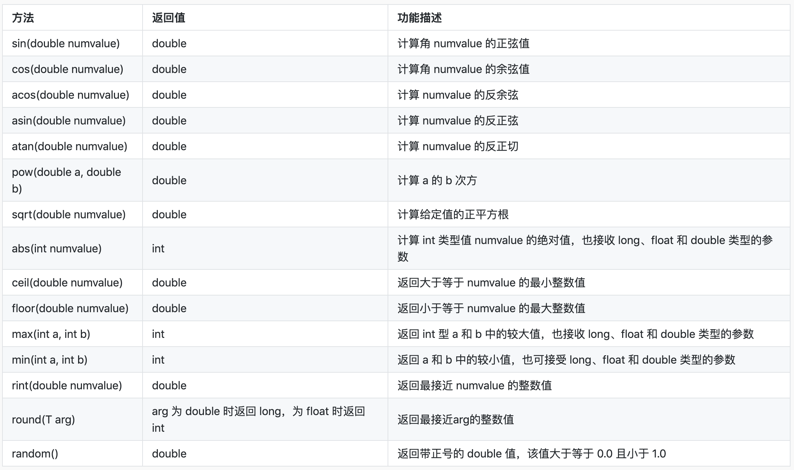

# 常用类

Java 类库提供了不少常用类，可以在编程中直接调用使用。本节讲重点讲解 Arrays、StringBuilder、Calendar、Date、Math、System、Random 类以及类的常用方法

知识点

- Arrays
- StringBuilder
- Calendar
- Date
- Math
- System
- Random

# Arrays

> 示例文件：[ArraysDemo](./day25/ArraysDemo.java)

Arrays 类包含用于操作数组的各种方法（例如排序和搜索）。还包含一个静态工厂，允许将数组转为 List


# StringBuilder

> 示例文件：[StringBuilderTest](./day26/StringBuilderTest.java)

StringBuilder 类是可变的。它是 String 的对等类，它可以增加和编写字符的可变序列，并且能够将字符插入到字符串中间或附加到字符串末尾（当然是不用创建其他对象的）

StringBuilder 的构造方法：


StringBuilder 类的常用方法：


# Calendar

> 示例文件：[CalendarDemo](./day27/CalendarDemo.java)

Calendar 类是一个抽象类，它完成 Date 类与普通日期表示法之间的转换，而我们更多的是使用 Calendar 类的子类 GregorianCalendar 类。它实现了世界上普遍使用的公历系统。当然我们也可以继承 Calendar 类，然后自己定义实现日历方法

先来看一看 GregorianCalendar 类的构造函数：


TimeZone 是 java.util 包中的一个类，其中封装了有关时区的信息。每一个时区对应一组 ID。类 TimeZone 提供了一些方法完成时区与对应 ID 两者之间的转换

例如：

```java
//太平洋时区的 ID 为 PST
TimeZone tz0 = TimeZone.getTimeZone("PST");
//getDefault()可以获取主机所处时区的对象
TimeZone tz1 = TimeZone.getDefault();
```

Locale 只是一种机制，它用来标识一个特定的地理、政治或文化区域获取一个 Locale 对象的构造方法：

```java
//调用Locale类的构造方法
Locale l0 = new Locale(String language);
Locale l1 = new Locale(String language, String country);
Locale l2 = new Locale(String languge, String country, String variant);

//调用Locale类中定义的常量
Locale  l1 = Locale.CHINA;
```

month 的含义与 Date 类相同，0 代表 1 月，11 代表 12 月

# Date

> 示例文件：[DateDemo](./day28/DateDemo.java)

Date 类表示日期和时间，里面封装了操作日期和时间的方法。Date 类经常用来获取系统当前时间

来看看类 Date 中定义的未过时的构造方法：

| 构造方法            | 说明                                                          |
| :-------------- | :---------------------------------------------------------- |
| Date()          | 构造一个 Date 对象并对其进行初始化以反映当前时间                                 |
| Date(long date) | 构造一个 Date 对象，并根据相对于 GMT 1970 年 1 月 1 日 00:00:00 的毫秒数对其进行初始化 |

**Date 类的很多方法自 JDK 1.1 开始就已经过时了**

# Math

> 示例文件：[MathDemo](./day29/MathDemo.java)

Math 类在 java.lang 包中，包含用于执行基本数学运算的方法，如初等指数、对数、平方根和三角函数

常见方法：


# System

> 示例文件：[SystemDemo](./day30/SystemDemo.java)

System 类提供了一下功能：

- 标准输入，标准输出和错误输出流；
- 访问外部定义的属性和环境变量；
- 加载文件和库的方法；
- 以及用于快速复制数组的实用方法

System 不可以被实例化，只可以使用其静态方法：

```java
//从指定的源数组中复制一个数组，从源数组指定的位置开始，到目标数组指定的位置
public static void arraycopy(Object src,int srcPos, Object dest,int desPos,int length)
//返回以毫秒为单位的当前时间(从1970年到现在的毫秒数)
public static long currentTimeMillis()
//终止当前正在运行的Java虚拟机，status为 0时退出
public static void exit(int status)
//  运行垃圾收集器
public static void gc()
// 取得当前系统的全部属性
public static Properties getProperties()
//获取指定键的系统属性
public static String  getProperty(String key)
```

# Random

> 示例文件：[RandomDemo](./day31/RandomDemo.java)

Random 类用于生成伪随机数流，在 java.util 包下
