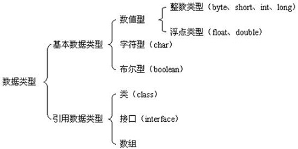
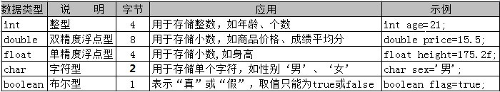

> Java 中一些需要关注的注意点

# 数据类型相关

## 有关数据类型见下图：



**String（字符串类型）是一种常见的引用数据类型**

## 有关常用基本数据类型定义见下图：



# 类型转换

## 自动数据类型转换

```Java
int score1=82;
double score2=score1;
System.out.println(score2);
```

代码中 int 型变量 score1 可以直接为 double 型变量 score2 完成赋值操作，运行结果为： 82.0

**自动类型转换是需要满足特定的条件:**

1.  目标类型能与源类型兼容，如 double 型兼容 int 型，但是 char 型不能兼容 int 型
2.  目标类型大于源类型，如 double 类型长度为 8 字节， int 类型为 4 字节，因此 double 类型的变量里直接可以存放 int 类型的数据，但反过来就不可以了

## 强制数据类型转换

语法如下：

```Java
double avg1=75.8;
int avg2=(int)avg1;
System.out.println(avg1);
Syetem.out.println(avg2);
```

过强制类型转换将 75.8 赋值给 int 型变量后，结果为 75，数值上并未进行四舍五入，而是直接将小数位截断

**强制类型转换可能会造成数据的丢失哦**，小伙伴们在应用时一定要慎重哦！

# 常量名

所谓常量，我们可以理解为是一种特殊的变量，它的值被设定后，在程序运行过程中不允许改变

语法：final(常量关键字) 数据类型 常量名 = 值;

```Java
final String SCHOOL="测试大学";
```

**程序中使用常量可以提高代码的可维护性**

**常量名一般使用大写字符**

# 注释

Java 中注释有三种类型：**单行注释**、**多行注释**、**文档注释**

## 文档注释

文档注释以 `/**` 开头，以 `*/` 结尾

## 多行注释

多行注释以 `/*` 开头，以 `*/` 结尾

## 单行注释

单行注释以 `//` 开头，以行末结尾

被注释的代码块在程序运行时是不会被执行的\~~

我们可以通过 javadoc 命令从文档注释中提取内容，生成程序的 API 帮助文档

使用文档注释时还可以使用 javadoc 标记，生成更详细的文档信息：

-   @author 标明开发该类模块的作者
-   @version 标明该类模块的版本
-   @see 参考转向，也就是相关主题
-   @param 对方法中某参数的说明
-   @return 对方法返回值的说明
-   @exception 对方法可能抛出的异常进行说明

# 比较运算符

1.  \>、 &lt; 、 >= 、 &lt;= 只支持左右两边操作数是数值类型
2.  == 、 != 两边的操作数既可以是数值类型，也可以是引用类型

# 三元运算符

语法形式：布尔表达式 ？ 表达式1 ： 表达式2

运算过程：如果布尔表达式的值为 true ，则返回 表达式1 的值，否则返回 表达式2 的值

# 条件语句 switch

不得不说的几点小秘密：

1.  switch 后面小括号中表达式的值必须是整型或字符型
2.  case 后面的值可以是常量数值，如 1、2；也可以是一个常量表达式，如 2+2 ；但不能是变量或带有变量的表达式，如 a \* 2
3.  case 匹配后，执行匹配块里的程序代码，如果没有遇见 break 会继续执行下一个的 case 块的内容，直到遇到 break 语句或者 switch 语句块结束
4.  可以把功能相同的 case 语句合并起来

    ```Java
    case 1:
    case 2:
      System.out.println("case 1、2 合并")
    ```

5.  default 块可以出现在任意位置，也可以省略

# for 循环

语法：

```Java
for (循环变量初始化;循环条件;循环变量变化){
  循环操作
}
```

需要留心的几个小细节：

1.  for 关键字后面括号中的三个表达式必须用 “;” 隔开，三个表达式都可以省略，但 “;” 不能省略

    -   省略“循环变量初始化”，可以在 for 语句之前由赋值语句进行变量初始化操作，如:

    ```Java
    int i=0; //循环变量 i 在 for 语句之前赋值
    for (;i<10;i++){//省略初始化变量
      System.out.println(i);
    }
    ```

    -   省略“循环条件”，可能会造成循环将一直执行下去，也就是我们常说的“死循环”现象
    -   省略“循环变量变化”，可以在循环体中进行循环变量的变化，如：

    ```Java
    for (int i=0;i<10;){
      System.out.println("i");
      i++ //循环体中改变变量 i 的值
    }
    ```

2.  for 循环变量初始化和循环变量变化部分，可以是使用 “,” 同时初始化或改变多个循环变量的值，如：

    ```Java
    for (int i=1,j=5;i<=5;i++,j--){
      System.out.println(i + "+" + j + "=" + (i+j));
    }
    ```

# 方法

Java 方法函数适用中，需要注意：

1.  如果方法的返回类型为 void ，则方法中不能使用 return 返回值
2.  方法的返回值最多只能有一个，不能返回多个值
3.  方法返回值的类型必须兼容，例如，如果返回值类型为 int ，则不能返回 String 型值

针对带参的函数方法，需要注意：

1.  调用带参方法时，必须保证实参的数量、类型、顺序与形参一一对应
2.  调用方法时，实参不需要指定数据类型
3.  方法的参数可以是基本数据类型，如 int、double 等，也可以是引用数据类型，如 String、数组等
4.  当方法参数有多个时，多个参数间以逗号分隔

## 方法的重载

问： 什么是方法的重载呢？

答： 如果同一个类中包含了两个或两个以上方法名相同、方法参数的个数、顺序或类型不同的方法，则称为方法的重载，也可称该方法被重载了

问： 如何区分调用的是哪个重载方法呢？

答： 当调用被重载的方法时， Java 会根据参数的个数和类型来判断应该调用哪个重载方法，参数完全匹配的方法将被执行。

>   判断方法重载的依据：
>
>   1、 必须是在同一个类中
>
>   2、 方法名相同
>
>   3、 方法参数的个数、顺序或类型不同
>
>   4、 与方法的修饰符或返回值没有关系

## static 修饰的静态方法

需要注意：

1.  静态方法中可以直接调用同类中的静态成员，但不能直接调用非静态成员
2.  如果希望在静态方法中调用非静态变量，可以通过创建类的对象，然后通过对象来访问非静态变量
3.  在普通成员方法中，则可以直接访问同类的非静态变量和静态变量
4.  静态方法中不能直接调用非静态方法，需要通过对象来访问非静态方法

# 类中的初始化块

Java 中可以通过初始化块进行数据赋值。如：

```Java
public class HelloWorld{
  String name; // 定义成员变量
  // 通过初始化块进行变量赋值
  {
    name = "初始化块赋值";
  }
}
```

在类的声明中，可以包含多个初始化块，当创建类的实例时，就会依次执行这些代码块。如果使用 static 修饰初始化块，就称为静态初始化块

**需要特别注意**：静态初始化块只在类加载时执行，且只会执行一次，同时静态初始化块只能给静态变量赋值，不能初始化普通的成员变量
