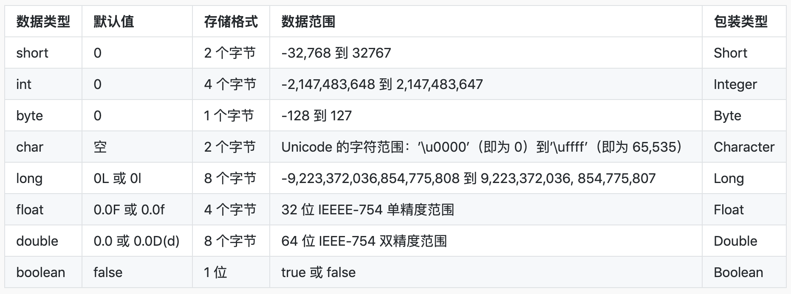
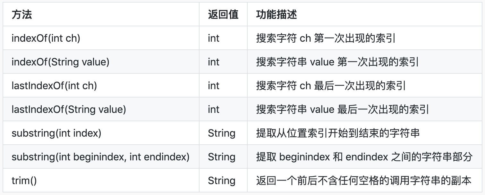
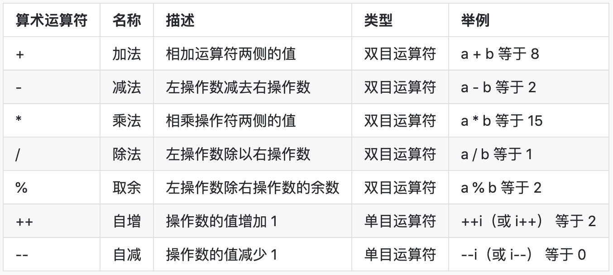
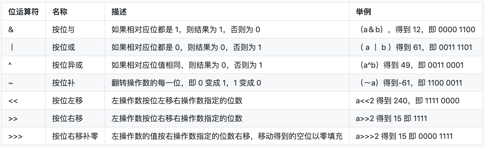
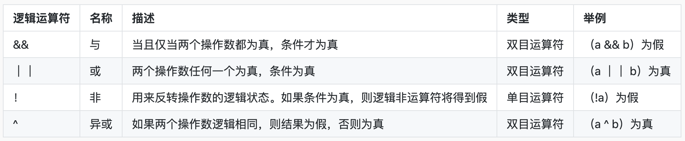
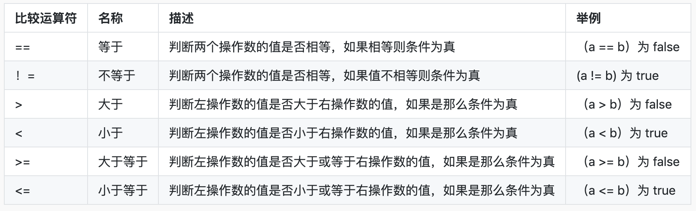
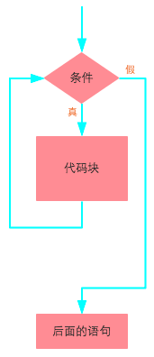
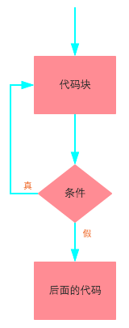

# JavaLR

Learning record for Java

# Java 环境

Java 是由 Sun Microsystems 公司于1995年5月推出的 Java 面向对象程序设计语言和 Java 平台的总称。由 James Gosling 和同事们共同研发，并在1995年正式推出。

Java 这门语言体系当中，最基础的部分就是 Java SE 部分，Java 的标准版本。它包括 Java 最基础的一些结构，包括面向对象的一些特性等等，同时它也是 Java 技术基础和核心。在 Java SE 的基础之上，又分为了 Java EE（Java 的企业版），应用于大型企业级应用的开发。Java ME 主要用于嵌入式开发。初学的时候我们都是从 Java SE 开始的。

JVM 叫 Java 虚拟机，它也是整个 Java 技术的核心。Java 语言的跨平台就多亏了 JVM。

JVM 叫 Java 虚拟机，它也是整个 Java 技术的核心。Java 语言的跨平台就多亏了 JVM。

JDK 叫 Java 开发工具包，没有 JDK 就没有办法进行 Java 程序的开发。

JRE 叫 Java 运行环境，如果我们需要运行一个 Java 程序，就得安装 JRE。

## 官网下载

安装 Java SE 环境，官网下载安装即可

**Win 环境变量问题**：

-   变量名：`JAVA_HOME`；变量值：`C:\Program Files (x86)\Java\jdk1.8.0_91`（此处为示例，实际修改为自己安装的本地路径）
-   变量名：`CLASSPATH`；变量值：`.;%JAVA_HOME%\lib\dt.jar;%JAVA_HOME%\lib\tools.jar;`
-   变量名：`Path`；变量值：`%JAVA_HOME%\bin;%JAVA_HOME%\jre\bin;`

# 学习记录简要

## 第一个 `Hello World`

> 示例文件：[HelloWorld](./day01/HelloWorld.java)

<span style="color:red">Java 中所有的代码都必须包含在 class 中，main 方法是程序的入口，</span>
并且 Java 是区分大小写的，如果写成 Main，那么程序将不能运行。
<span style="color:red">使用 public 修饰的 class 必须和源代码文件名相同。</span>

## 变量

> 示例文件：[VarTest](./day02/VarTest.java)

变量声明格式：`数据类型 变量名称；`
例如：`int a=1;`

在该语法格式中，数据类型可以是 Java 语言中任意的类型，如int。变量名称是该变量的标识符，需要符合标识符的命名规则，数据类型和变量名称之间使用空格进行间隔，使用;作为结束。

## 常量

> 示例文件：[FinalVar](./day03/FinalVar.java)

可看作特殊的变量，只是它们在程序的运行过程中是不允许改变的。**常量的值是不能被修改的**。

声明关键字：`final`，可以用于声明属性（常量），方法和类。

final修饰属性时，代表该属性一旦被分配内存空间就必须初始化, 它的含义是“这是无法改变的”或者“终态的”。在变量前面添加关键字final即可声明一个常量。在 Java 编码规范中，**要求常量名必须大写**。

语法格式：`final 数据类型 常量名 = 值;`
例如：`final double PI = 3.14;`
常量也可以先声明，再进行赋值，但只能赋值一次，比如： ​

```java
  final int FINAL_VARIABLE; ​
  FINAL_VARIABLE = 100;
```

## 数据类型



整数
byte、short、int、long 四种基本数据类型表示整数，需要注意的是 long 类型，**使用 long 修饰的变量需要在数值后面加上 L 或者 l，比如`long num=1L;`，一般使用大写 L，为了避免小写 l 与数值 1 混淆**。

浮点数
float 和 double 类型表示浮点数，即可以表示小数部分。需要注意的是 float 类型，**其数值后面需要加上 F 或者 f，否则会被当成 double 类型处理。** double 类型的数值可以加上 D 或 d，也可以不加。

char 类型
char 类型用于表示单个字符。需要将字符用单引号括起来`char a='a'`，char 可以和整数互相转换，如果字符a也可以写成`char a=97`。也可以用十六进制表示`char a = '\\u0061'`。

boolean 类型
boolean 类型（布尔类型）用于表示真值 true 或者假值 false，Java 中布尔值不能和整数类型或者其它类型互相转换。

## 字符串

> 示例文件：[StringTest](./day04/StringTest.java)

Java 中使用 String 类来定义一个字符串，字符串是常量，它们的值在创建之后不能更改。字符串缓冲区支持可变的字符串。

String 对象的初始化格式有如下两种：

```java
String s0 = "abc";
String s1 = new String("abd");
```

> 常用字符串方法:调用方法（字符串对象.方法名）
>
> -   `length()`:计算字符串长度，返回一个 int 类型的整数（字符串中字符数，中文字符也是一个字符）
> -   `equals()`:字符串比较，判断两个字符串对象的内容是否相同。如果相同则返回 true，否则返回 false。比较是从第一字符开始，一个字符一个字符依次比较
> -   `equalsIgnoreCase()`:与 equals 相比，是忽略大小写的比较
> -   `charAt()`:按照索引值(规定字符串中第一个字符的索引值是 0，第二个字符的索引值是 1，依次类推)，获得字符串中的指定字符



## 算术运算符

> 示例文件：[ArithmeticOperation](./day05/ArithmeticOperation.java)

算术运算符用在数学表达式中，主要实现的是算术运算，如常见的加法、减法、乘法、除法等。

表格中的例子中，变量a的值为 5，变量b的值为 3，变量i的值为 1：


其中，自增(++)和自减(--)运算符有两种写法：前缀（++i,--i）和后缀（i++,i--）

-   前缀自增自减法(++i,--i): 先进行自增或者自减运算，再进行表达式运算。
-   后缀自增自减法(i++,i--): 先进行表达式运算，再进行自增或者自减运算

## 二进制位运算符

> 示例文件：[BitOperation](./day06/BitOperation.java)

Java 定义了位运算符，应用于整数类型(int)，长整型(long)，短整型(short)，字符型(char)，和字节型(byte)等类型。

<p style="color:red">位运算时先转换为二进制，再按位运算。</p>

表格中的例子中，变量a的值为 60，变量b的值为 13：


## 逻辑运算符

> 示例文件：[LogicOperation](./day07/LogicOperation.java)

逻辑运算符是通过运算符将操作数或等式进行逻辑判断的语句。

表格中的例子中，假设布尔变量 a 为真，变量 b 为假：

当使用&&(与)逻辑运算符时，在两个操作数都为 true 时，结果才为 true，但是当得到第一个操作为 false 时，其结果就必定是 false，这时候就不会再判断第二个操作了

## 关系运算符

> 示例文件：[RelationalOperation](./day08/RelationalOperation.java)

关系运算符生成的是一个 boolean（布尔）结果，它们计算的是操作数的值之间的关系。如果关系是真实的，结果为 true（真），否则，结果为 false（假）。

表格中的例子中，假设变量 a 为 3，变量 b 为 5：


除了上表列出的二元运算符，Java 还有唯一的一个三目运算符 ?:

**语法格式： 布尔表达式？表达式 1 : 表达式 2**

运算过程：如果布尔表达式的值为true ，则返回 表达式1 的值，否则返回 表达式2 的值。

**强调：**

-   ==和!=适用于所有的基本数据类型，其他关系运算符不适用于boolean，因为 boolean 值只有true和false，比较没有任何意义
-   ==和!=也适用于所有对象，可以比较对象的引用是否相同

引用：Java 中一切都是对象，但操作的标识符实际是对象的一个引用

## 方法

> 示例文件：[MethodDemo](./day09/MethodDemo.java)

方法的定义语法：

```java
访问修饰符 返回值类型 方法名(参数列表){
    方法体
}
```

例如：

```java
public void functionName(Object arg){

}
```

语法说明：

-   **访问修饰符**：代表方法允许被访问的权限范围， 可以是 public、protected、private 或者省略（default） ，其中 public 表示该方法可以被其他任何代码调用
-   **返回值类型**：方法返回值的类型，如果方法不返回任何值，则返回值类型指定为 void (代表无类型)；如果方法具有返回值，则需要指定返回值的类型，并且在方法体中使用 return 语句返回值
-   **方法名**：方法的名字，必须使用合法的标识符
-   **参数列表**：是传递给方法的参数列表，参数可以有多个，多个参数间以逗号隔开，每个参数由参数类型和参数名组成，以空格隔开。参数列表是指方法的参数类型、顺序和参数的个数。参数是可选的，方法可以不包含任何参数
-   **方法体**：方法体包含具体的语句，定义该方法的功能

## 流程控制（if、switch、while、do-while、for、break、continue）

> 示例文件：[ProcessControl](./day10/ProcessControl.java)

1.  if

if 语句是一种判断语句  
示例：

```Java
if(条件){
    条件成立时执行的代码
}
```

if...else 语句当条件成立时，则执行 if 部分的代码块； 条件不成立时，则进入 else 部分  
示例：

```Java
if(条件){
    代码块1
}
else{
    代码块2
}
```

if...else if：

多重 if 语句，在条件 1 不满足的情况下，才会进行条件 2 的判断，以此向下；当前面的条件均不成立时，最终执行 else 块内的代码  
示例：

```java
if(条件1){
    代码块1
}
else if(条件2){
    代码块2
}
...
else {
    代码块n
}
```

> 注：所有的条件语句都是利用条件表达式的真或假来决定执行路径，Java 里不允许将一个数字作为布尔值使用，虽然这在C和C++是允许的，如果要在布尔测试里使用一个非布尔值，需要先用一个条件表达式将其转换成布尔值，其他控制语句同理

2.  switch

当需要对选项进行等值判断时，使用 switch 语句更加简洁明了：

当 switch 后表达式的值和 case 语句后的值相同时，从该位置开始向下执行，直到遇到 break 语句或者 switch 语句块结束；如果没有匹配的 case 语句则执行 default 块的代码

```Java
switch(表达式){
    case 值1:
        代码块1
        break;
    case 值2:
        代码块2
        break;
    ...
    default:
        默认执行的代码块
}
```

3.  while 和 do-while

while 语法：

```java
while(条件){
    代码块
}
```

while 的执行过程是先判断，再执行：

-   判断 while 后面的条件是否成立( true or false )
-   当条件成立时，执行循环内的代码，然后重复执行1.、2.， 直到循环条件不成立为止



do-while 语法：

```Java
do{
    代码块
}while(条件);
```

do-while 的执行过程是先执行，再判断（所以循环内的代码至少会执行一次）:

-   先执行一遍循环操作，然后判断循环条件是否成立
-   如果条件成立，继续执行1.、2.，直到循环条件不成立为止



3.  for

for 语法：

```java
for(循环变量初始化; 循环条件; 循环变量变化){
    循环操作
}
```

for 相比 while 和 do-while 语句结构更加简洁易读，它的执行顺序：

-   执行循环变量初始化部分，设置循环的初始状态，此部分在整个循环中只执行一次
-   进行循环条件的判断，如果条件为 true，则执行循环体内代码；如果为 false ，则直接退出循环
-   执行循环变量变化部分，改变循环变量的值，以便进行下一次条件判断
-   依次重新执行2.、3.、4.，直到退出循环


4.  break & continue

    -   **break** 关键字经常用在条件和循环语句中，用来跳出循环语句
    -   **continue** 关键字的作用是跳过循环体中剩余的语句执行下一次循环
