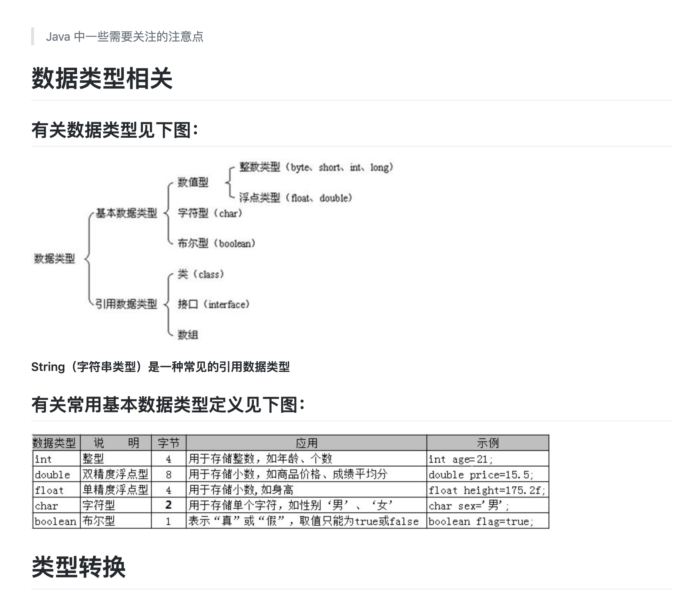
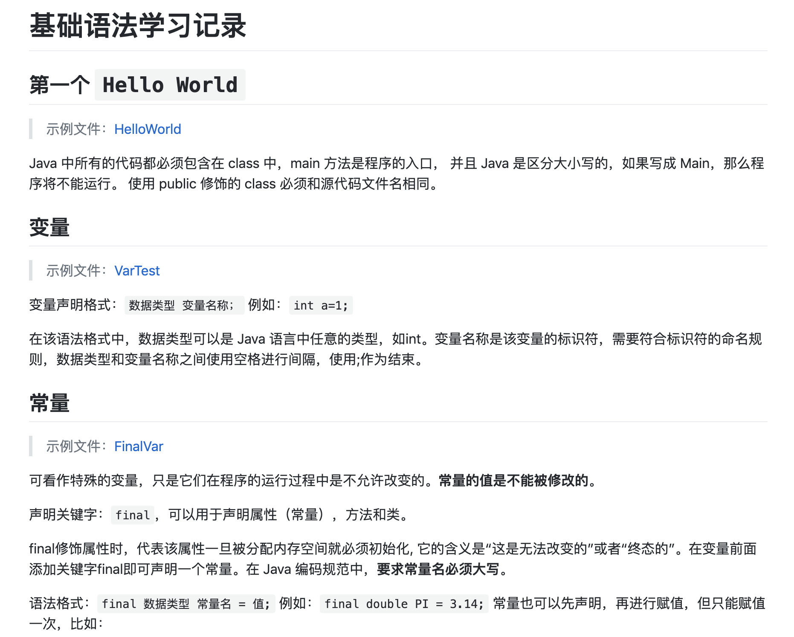
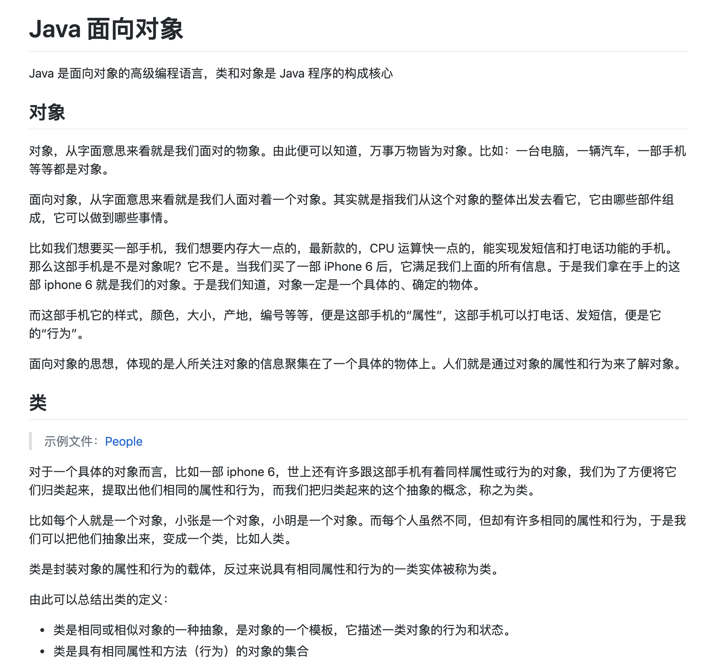
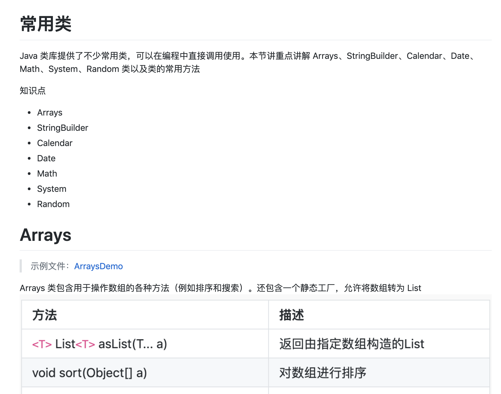

# JavaLR

Learning record for Java

# Java 环境

Java 是由 Sun Microsystems 公司于1995年5月推出的 Java 面向对象程序设计语言和 Java 平台的总称。由 James Gosling 和同事们共同研发，并在1995年正式推出。

Java 这门语言体系当中，最基础的部分就是 Java SE 部分，Java 的标准版本。它包括 Java 最基础的一些结构，包括面向对象的一些特性等等，同时它也是 Java 技术基础和核心。在 Java SE 的基础之上，又分为了 Java EE（Java 的企业版），应用于大型企业级应用的开发。Java ME 主要用于嵌入式开发。初学的时候我们都是从 Java SE 开始的。

JVM 叫 Java 虚拟机，它也是整个 Java 技术的核心。Java 语言的跨平台就多亏了 JVM。

JDK 叫 Java 开发工具包，没有 JDK 就没有办法进行 Java 程序的开发。

JRE 叫 Java 运行环境，如果我们需要运行一个 Java 程序，就得安装 JRE。

## 官网下载

安装 Java SE 环境，官网下载安装即可

**Win 环境变量问题**：

-   变量名：`JAVA_HOME`；变量值：`C:\Program Files (x86)\Java\jdk1.8.0_91`（此处为示例，实际修改为自己安装的本地路径）
-   变量名：`CLASSPATH`；变量值：`.;%JAVA_HOME%\lib\dt.jar;%JAVA_HOME%\lib\tools.jar;`
-   变量名：`Path`；变量值：`%JAVA_HOME%\bin;%JAVA_HOME%\jre\bin;`

# 注意点汇总

Java 学习中记录的一些小细节点，详细见：

[LimeLight](./LimeLight.md)

注意点学习记录示例图：

# 基础语法学习

详细见：[ElementarySyntax](./ElementarySyntax/ElementarySyntax.md)

基础语法学习记录示例图：

# 面向对象学习

详细见：[Object-Oriented](./Object-Oriented/Object-Oriented.md)

面向对象学习记录示例图：

# 常用类

详细见：[CommonClasses](./CommonClasses/CommonClasses.md)

常用类学习记录示例图：

