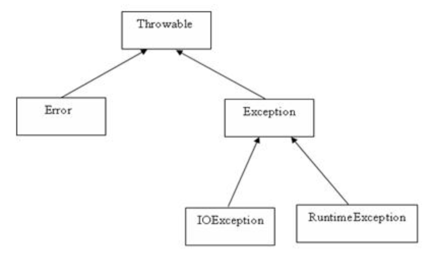

# 异常

## 异常简介

异常是程序中的一些错误，但并不是所有的错误都是异常，并且错误有时候是可以避免的。

比如说，你的代码少了一个分号，那么运行出来结果是提示是错误 java.lang.Error；如果你用System.out.println(11/0)，那么你是因为你用0做了除数，会抛出 java.lang.ArithmeticException 的异常

要理解Java异常处理是如何工作的，你需要掌握以下三种类型的异常：

-   检查性异常：最具代表的检查性异常是用户错误或问题引起的异常，这是程序员无法预见的。例如要打开一个不存在文件时，一个异常就发生了，这些异常在编译时不能被简单地忽略
-   运行时异常： 运行时异常是可能被程序员避免的异常。与检查性异常相反，运行时异常可以在编译时被忽略
-   错误： 错误不是异常，而是脱离程序员控制的问题。错误在代码中通常被忽略。例如，当栈溢出时，一个错误就发生了，它们在编译也检查不到的

## Exception 类的层次

所有的异常类是从 java.lang.Exception 类继承的子类

Exception 类是 Throwable 类的子类。除了Exception类外，Throwable还有一个子类Error

异常类有两个主要的子类：IOException 类和 RuntimeException 类



# 处理异常

> 示例文件：[TryCatchTest](./day25/TryCatchTest.java)

try...catch... 基本语法：

```java
try {
  //一些会抛出异常的方法
} catch (Exception e) {
  //处理该异常的代码块
}
```

多种异常需要使用多个 catch 语句块儿来捕获进行不同的处理，如：

```java
try {
  //一些会抛出异常的方法
} catch (Exception e) {
  //处理该异常的代码块
} catch (Exception2 e) {
  //处理该异常2的代码块
}
```

多重异常 catch 使用时需要注意的问题：

1.  顺序问题：要有异常的子类到父类的顺序捕获
2.  注意善后工作的处理

try...catch...finally... 基本语法：

```java
try {
  //一些会抛出异常的方法
} catch (Exception e) {
  //处理该异常的代码块
} catch (Exception2 e) {
  //处理该异常2的代码块
} finally {
  //最终要执行的一些代码
}
```
